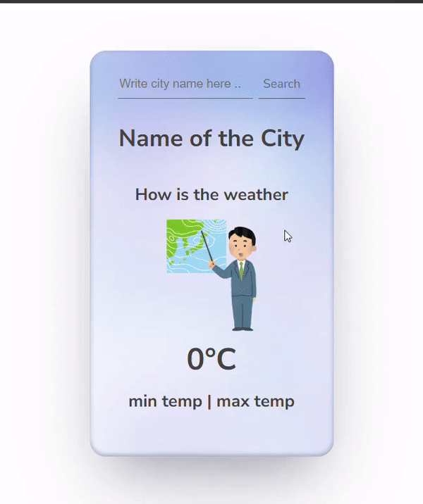

# Weather Application

A simple weather application that fetches and displays weather information for a specified city using the WeatherAPI service.

## Table of Contents

- [Installation](#installation)
- [Usage](#usage)
- [Features](#features)
- [API Used](#api-used)
- [File Structure](#file-structure)
- [Contributing](#contributing)
- [License](#license)

## Installation

1. **Clone the repository**:
    ```bash
    git clone https://github.com/your-username/weather-app.git
    cd weather-app
    ```

2. **Open the project**:
    Open the project directory in your preferred code editor.

3. **Set up the API key**:
    - Sign up at [WeatherAPI](https://www.weatherapi.com/) to get your free API key.
    - Replace `'YOUR_API_KEY'` in the `index.js` file with your actual API key.

4. **Open the application**:
    Open `index.html` in your web browser to run the application.

## Usage

1. Enter the name of a city in the input field.
2. Click the "Search" button.
3. The application will display the weather information for the specified city, including the city name, weather description, temperature, and an icon representing the weather.

## Features

- Fetches current weather data for cities worldwide.
- Displays weather information including city name, weather description, temperature, and weather icon.
- Dynamically changes the input field color when typing.

## API Used

- **WeatherAPI**:
    - Endpoint: `https://api.weatherapi.com/v1/current.json`
    - Sign up for a free API key at [WeatherAPI](https://www.weatherapi.com/).

## File Structure

